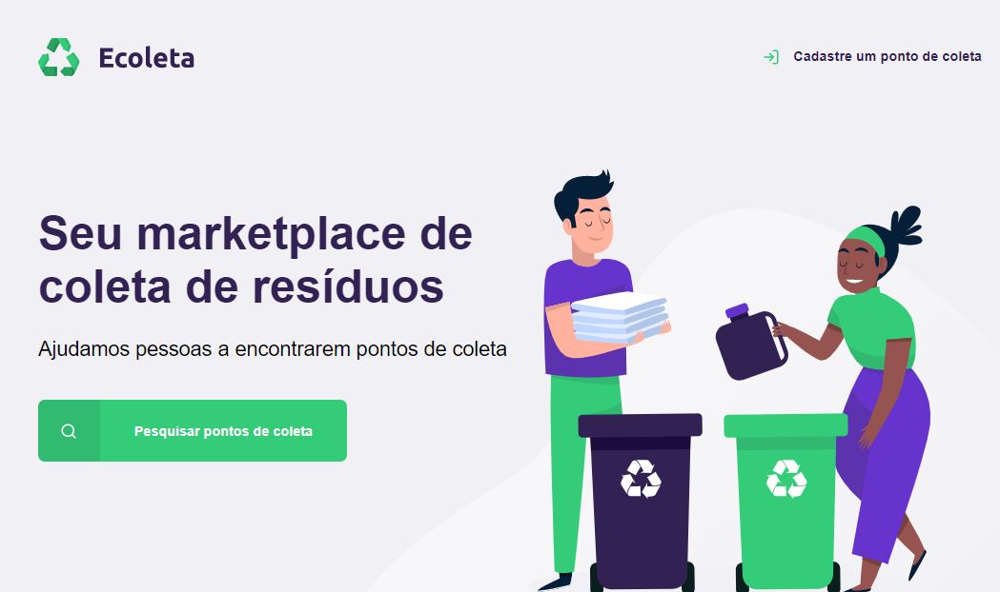

=======
# Next-Level-Week
Projeto desenvolvido com orientação da Rocketseat. Criamos um app de cadastro e busca de pontos de coleta de resíduos.
>>>>>>> 32ab2324305520374a8b17b03e3a237491b9717b

</h1>

📋**Sobre**
##### O projeto **Next Level Week** resultou em um app de busca e cadastramento de pontos de coleta de resíduos, foi desenvolvido por meio da orientação da Rocketseat. O intuito do projeto foi aprimorar o conhecimento dos alunos e levá-los ao próximo nível no desenvolvimento web.

##### 📌 Tecnologias utilizadas:

##### - JS
##### - Nunjucks
##### - Node.js
##### - Express
##### - CSS3
##### - HTML5
##### - SQL

---

##### 🔍 Link para o Github:
{https://github.com/bruna-devbio/Next-Level-Week}
